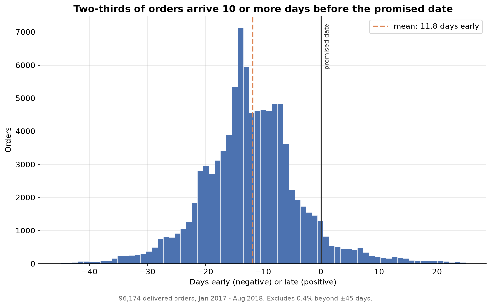
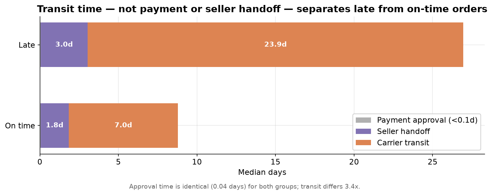
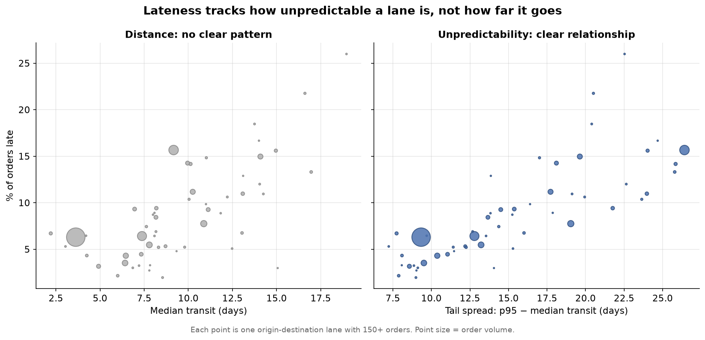
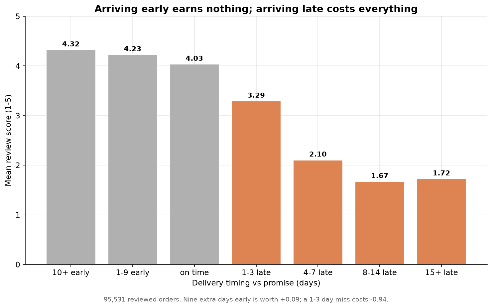
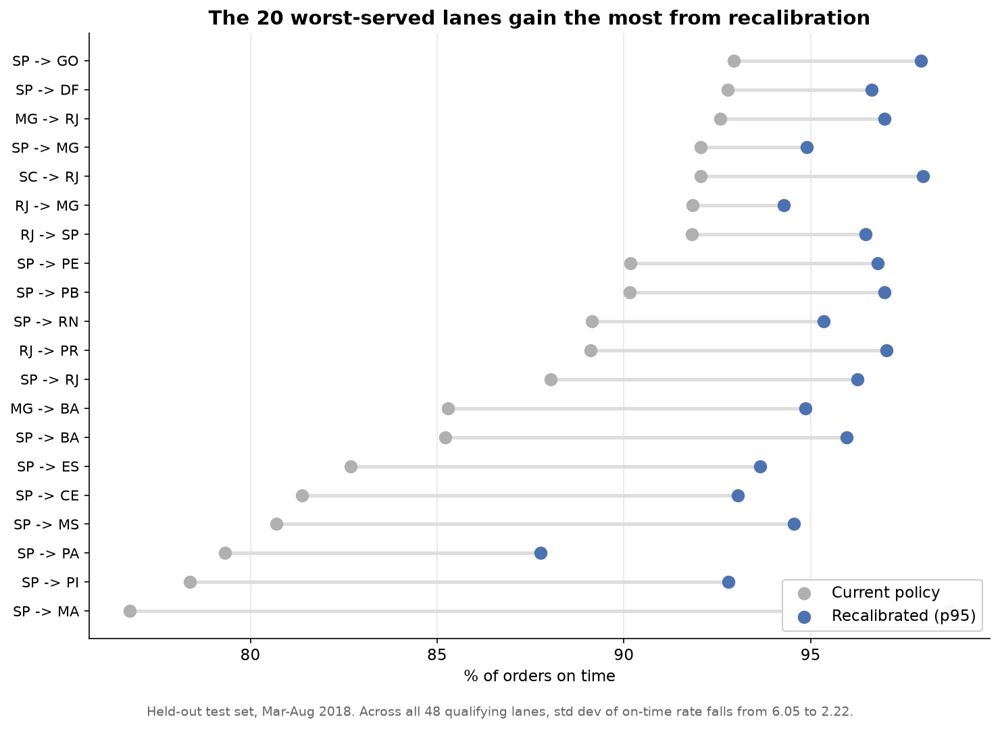

# Delivery Promise Reliability

**Is the delivery date shown at checkout calibrated to actual delivery performance?**

An analysis of 96,174 Brazilian e-commerce orders examining whether a marketplace's
delivery promises reflect how long shipments really take — and what happens when
promises are recalibrated to each shipping lane's own history.

---

## Summary

Olist's delivery promise is **not over-padded in aggregate**. At an average of 22.5
quoted days against a 29-day 95th-percentile delivery time, it runs at roughly a 93%
service level — a defensible operational target.

The problem is **allocation**. A near-constant ~12-day buffer is applied across lanes
whose tail spreads range from 8.6 to 26.4 days, producing on-time rates from 76.8% to
100% depending on where the customer lives.

Recalibrating each lane to its own percentile of historical lead time cut the
late-delivery rate from **7.0% to 3.1% — a 56% reduction** — measured on 39,152
held-out orders the model never saw.



---

## The question

Every online checkout displays a delivery date. That date is a **promise** generated
before anything is known about how the shipment will actually go.

A promise that is too long costs sales invisibly: a shopper comparing two sites, one
quoting 24 days and one quoting 12, picks the second, and the first never learns why.
A promise that is too short costs refunds, support tickets, and public reviews.

The target is a promise tight enough to win the sale and honest enough to keep. This
project measures how far the current promise sits from that target, and whether the
gap can be closed.

---

## Key findings

### 1. Two-thirds of orders arrive 10 or more days early

| Delivery vs promise | Orders | Share |
|---|---|---|
| 20+ days early | 16,189 | 16.8% |
| 10–20 days early | 45,381 | **47.2%** |
| 5–10 days early | 20,128 | 20.9% |
| 1–5 days early | 6,656 | 6.9% |
| Exactly on time | 1,291 | 1.3% |
| 1–5 days late | 2,768 | 2.9% |
| 5+ days late | 3,761 | 3.9% |

Median promise error is −12 days against a mean of −11.8, so the padding is a
**systemic shift of the whole distribution**, not a handful of outliers dragging an
average.

### 2. Transit is 75% of lead time and effectively all of the variance



Total lead time decomposes into three segments owned by three different parties:

| Segment | Mean | Median | p95 | Tail spread | Share of total |
|---|---|---|---|---|---|
| Payment approval | 0.40 | 0.04 | 1.92 | 1.88 | 3.2% |
| Seller handoff | 2.82 | 1.83 | 8.04 | 6.21 | 22.5% |
| **Carrier transit** | **9.37** | **7.13** | **24.38** | **17.25** | **74.8%** |

Comparing late against on-time orders isolates the driver:

| | Approval | Handoff | Transit |
|---|---|---|---|
| Late (n=7,788) | 0.04 | 3.00 | **23.92** |
| On time (n=87,050) | 0.04 | 1.79 | **6.96** |

Approval is **identical** between the two groups. Handoff differs by 1.2 days. Transit
differs by 17 days — a 3.4× multiple. Late orders are not slow at every stage; they are
orders that got stuck in transit.

This rules things out as much as it rules things in: payment processing and seller
behaviour are not where the problem lives.

### 3. Lateness tracks unpredictability, not distance



A buffer does not protect against the typical day — it protects against the bad day.
So the right buffer size depends on how *unpredictable* a route is, not how long it is.

The clearest case in the data:

| Lane | Median transit | p95 transit | Tail spread | % late |
|---|---|---|---|---|
| SP → RJ | 9.2 days | 35.6 | **26.4** | **15.7%** |
| SP → GO | 11.1 days | 25.6 | 14.5 | 9.3% |

**Rio de Janeiro is the shorter trip and is late nearly twice as often.** If distance
drove lateness, that could not happen. Across all lanes, on-time rate correlates with
tail spread and shows no clean relationship with median transit.

### 4. The promise is already lane-aware — but the buffer is flat

Median promise error by lane sits between −10 and −15 days regardless of how long the
lane actually takes. Olist is estimating expected transit per destination and then
adding a roughly constant cushion on top.

That constant cushion is the failure. It over-protects predictable lanes and
under-protects volatile ones:

| Lane | Median transit | Buffer | % late |
|---|---|---|---|
| SP → SP | 4.4 days | −11 days | 6.0% |
| MA (Maranhão) | 15.7 days | −10 days | **20.0%** |

Maranhão receives *less* buffer than São Paulo despite 3.6× the transit time, and is
late more than three times as often.

### 5. Lateness is punished sharply; earliness is not rewarded



Joining review scores to delivery outcomes (95,531 reviewed orders, 99.3% coverage):

| | On time | Late |
|---|---|---|
| Mean review score | 4.29 | **2.57** |
| 1-star rate | 6.6% | **46.2%** |
| 5-star rate | 62.4% | 22.2% |

The dose-response curve reveals a **sharply asymmetric loss function**:

- Arriving 10+ days early scores 4.32; arriving 1–9 days early scores 4.23.
  **Nine extra days of earliness is worth 0.09 review points.**
- Missing by just 1–3 days costs **0.94 points** — over ten times what nine days of
  earliness gains.
- Damage saturates around 8–14 days late (1.67) and does not worsen beyond that (1.72
  at 15+ days).

Repeat-purchase rates differ in the expected direction (1.35% on-time vs 1.05% late
within 90 days) but the effect is small, only marginally significant, and confounded
by geography. **The review channel, not direct churn, is where lateness costs money** —
reviews are public and shape whether the next shopper buys.

---

## The hypothesis this project overturned

The first pass at this analysis compared the ~24-day average promise against the
**12.5-day mean** delivery time and concluded that promises could be shortened by
roughly 10 days while holding on-time performance above 90%.

**A held-out test proved that false.**

| Policy | Mean promise | Days saved | On-time |
|---|---|---|---|
| Current | 22.5 days | — | 93.0% |
| Recalibrated p90 | 21.6 days | **+0.9** | 93.3% |
| Recalibrated p92 | 23.6 days | −1.1 | 94.8% |
| Recalibrated p95 | 27.4 days | −4.8 | 96.9% |

The best case saves under a day. Anything more reliable *costs* days.

**Why the original claim was wrong:** a promise does not cover the mean order, it
covers the tail. Median delivery is 10 days but p95 is **29 days**. To be on time 95%
of the time you need roughly 29 days. At 22.5 days the current promise is already
*below* that — the company is running at ~93%, not padding to 99%. There was never
10 days of slack to reclaim.

**Why this was predictable in hindsight:** lane explains only 23.5% of variance in
transit time. The remaining 76.5% is unpredictable within-lane noise, and buffer is the
only thing that covers noise. Finer segmentation can only recover what segmentation
explains. Small variance explained implies small savings — the two results are
internally consistent.

The correct finding sits underneath the wrong one: **the buffer is not wrong in size,
it is wrong in shape.**

---

## Data

[Olist Brazilian E-Commerce dataset](https://www.kaggle.com/datasets/olistbr/brazilian-ecommerce)
— public on Kaggle, anonymised. Olist connects small Brazilian merchants to large
marketplace storefronts; customers buy through a marketplace, orders route through
Olist to the seller, and the seller ships.

Nine CSV files covering orders, customers, sellers, order items, payments, reviews,
products, geolocation, and category translations. ~100,000 orders from September 2016
to October 2018 across ~3,000 sellers and ~70 product categories.

Each order in `olist_orders_dataset.csv` carries five timestamps — purchase, payment
approval, carrier handoff, customer delivery, and the delivery date promised at
checkout. Every metric in this analysis derives from the gaps between them.

---

## Inclusion rules

Every narrowing in this project, with its reason:

```
99,441   all orders in the raw data
96,478   delivered orders                    -2,963  no completed delivery to measure
96,174   analysis base                         -304  missing timestamps, out-of-window,
                                                     corrupt approval gaps
39,152   held-out test set                          Mar-Aug 2018; the rest trains the model
    57   lanes with 100+ training orders           enough history to price a promise
    48   lanes with 100+ test orders               enough volume to measure reliably
```

**Retention from raw to analysis base: 96.7%.**

Detail on the 304:

- **Status filter.** Only `delivered` orders have a completed delivery duration.
  Canceled, shipped, unavailable, invoiced, processing, created, and approved statuses
  are excluded (3.0% of orders combined).
- **Timestamp completeness.** 14 delivered orders lack an approval timestamp, 2 lack a
  carrier date, 8 lack a customer delivery date. At most 24 rows out of 96,478.
- **Date window.** Restricted to 2017-01-01 through 2018-08-31. 2016 contributed 329
  orders across three months (one of them containing zero orders). September and
  October 2018 contributed 20 combined.
- **Corrupt approval gaps.** 14 orders where the carrier scan preceded payment approval
  by more than 7 days (see below).

---

## Data quality decisions

### The 1,350 impossible timestamps

1,350 delivered orders (1.4%) recorded the package reaching the carrier **before**
payment was approved. The intuitive response is to delete them. Testing first showed
that deletion would have biased the baseline in the wrong direction.

**How large is the gap?**

| Gap | Orders |
|---|---|
| 0–6 hours | 623 |
| 6–24 hours | 300 |
| 1–3 days | 334 |
| 3–7 days | 79 |
| Over 7 days | 14 |

Median gap: 17 hours. 68% under 24 hours.

**Are these orders otherwise normal?**

| Group | n | Median total days | p95 total days |
|---|---|---|---|
| Violation | 1,350 | **7.0** | **19.0** |
| Clean | 95,105 | 10.0 | 29.0 |

The violating orders are **30% faster** than clean ones. Corrupt records would scatter
in both directions; these are systematically better. They are real, completed,
unusually quick deliveries.

**Mechanism:** carrier scans post in real time while payment approvals settle on a
nightly batch cycle. On fast-moving orders the seller ships before the approval record
catches up. The timestamp is wrong; the order is not. This is corroborated
independently by the decomposition — normal payment approval takes a median of 0.04
days (about an hour), which is exactly the scale at which a nightly batch would produce
this artifact.

**Rule adopted.** Records where the carrier scan precedes payment approval are retained
for total lead time — they are complete, verified deliveries and are faster than the
clean population, so excluding them would bias the baseline low — but flagged via
`approval_suspect` and suppressed from the approval and handoff segment analysis. The
14 records with gaps beyond 7 days (maximum: 171 days) have no such explanation and are
dropped as corrupt.

`n_approval_suspect` in the final base = 1,336 = 1,350 − 14, confirming the filter did
precisely what was designed with no unintended exclusions.

### Order origin

An order can contain items from multiple sellers, which would leave it without a single
origin for lane analysis. Measured before designing the schema:

- **98.68%** of orders have exactly one seller
- **99.47%** of orders have exactly one seller *state*

Only 506 orders (0.53%) span multiple origin states. Grain is therefore **one row per
order**, with origin assigned as the state of the seller whose item shipped last, since
that seller gates the delivery. At 506 orders, no defensible tiebreaker rule could shift
the conclusions.

### Open question: multi-seller orders perform better

Orders with multiple sellers are **5.5× less likely to be late** (1.5% vs 8.3%) with a
shorter tail (p95 17.8 vs 24.7 days). This is counterintuitive — more sellers should
mean more coordination risk.

The likely explanation is selection rather than causation: an order can only contain
items from multiple sellers if several sellers simultaneously stock what the customer
wanted, which skews toward high-volume, professionalised sellers in dense metro areas
with good carrier coverage. Not pursued further — 1.3% of orders, off the critical path.

---

## Method

### 1. Lead time decomposition

Total lead time split into approval, handoff, and transit segments. Computed in hours
and divided by 24 rather than using day-level date differences, which count calendar
boundaries crossed rather than elapsed time — a distinction that matters for the
approval segment, which often completes in under an hour.

Validated by confirming segments sum to total: mean sum-of-segments 12.596 days against
mean total 12.535, a gap of 0.061 days attributable to day-vs-hour rounding.

### 2. Star schema

`fct_orders` (one row per order, 96,174 rows) with `dim_customer_geo`, `dim_seller_geo`,
and derived lane keys. Customer and seller state are denormalised onto the fact table to
avoid two joins on every geographic query.

Row-count integrity verified before use: base rows, fact rows, and distinct order IDs
all equal 96,174, with zero null states. Join fan-out is the most common way to silently
corrupt an analysis, so this check runs before any interpretation.

### 3. Recalibration with a temporal train/test split

| Split | Orders | Window | Role |
|---|---|---|---|
| Train | 57,022 | 2017-01-05 → 2018-02-28 | sets the promises |
| Test | 39,152 | 2018-03-01 → 2018-08-29 | grades them |

Split by **date, not randomly**. Random splitting would let the model learn from June to
predict April. A temporal split simulates the real problem: standing in February 2018
with only past data, setting promises for orders that have not happened yet.

Promises were computed as the ceiling of each lane's percentile of `total_days` in the
training window, then frozen and applied to test orders. Three-tier fallback:

| Tier | Condition | Test orders |
|---|---|---|
| Lane | 100+ training orders on that lane | 93.1% |
| Destination state | otherwise | 6.9% |
| National | otherwise | 0% |

This mirrors what a production system must do when a new lane appears with no history.

---

## Results

### Aggregate, on 39,152 held-out orders

| Policy | Mean promise | On-time | Late rate |
|---|---|---|---|
| Current | 22.5 days | 93.0% | 7.0% |
| Recalibrated p90 | **21.6 days** | **93.3%** | 6.7% |
| Recalibrated p95 | 27.4 days | **96.9%** | **3.1%** |

**p90 is a strict improvement on every dimension** — shorter promises, higher on-time
rate, better worst case, less dispersion. Nothing is traded away. This is possible only
because the current policy is misallocated rather than uniformly wrong: redistributing
the same total buffer according to each lane's own tail improves everything at once.

**p95 is a deliberate purchase** — 4.8 additional days buys a 56% reduction in late
deliveries.

### Service-level dispersion, across 48 measurable lanes

| Policy | Worst lane | Best lane | Std dev | vs current |
|---|---|---|---|---|
| Current | 76.8% | 100.0% | 6.05 | — |
| Recalibrated p90 | 79.7% | 100.0% | 3.68 | **−39%** |
| Recalibrated p95 | 87.8% | 100.0% | 2.22 | **−63%** |



Under the current policy, roughly 1 in 4 orders on the worst lane arrives late while
the best lanes are never late. Recalibration closes most of that gap.

Lane-level effect at p95 shows the redistribution directly:

| Lane | Current promise | Recalibrated | Change |
|---|---|---|---|
| SP → RJ | 29.3 days | 41.0 | **+11.7** |
| SP → BA | 28.8 days | 38.0 | +9.2 |
| SP → SC | 25.7 days | 35.0 | +9.3 |
| PR → SP | 25.2 days | 24.0 | **−1.2** |

High-variance lanes get more room; predictable ones get less.

### Lanes that regressed

Six of 48 lanes (12.5%) saw on-time rates decline, by an average of 1.2 points. **All
six were previously above 95%, and none fell below 93.8%.** One was at exactly 100% —
a promise so padded that nothing could miss it.

This is the intended behaviour. Recalibration targets a uniform service level, so lanes
running *above* target are trimmed toward it, freeing days for customers who need them.
The review analysis confirms the trade is favourable: customers gain 0.09 review points
from nine extra days of earliness, so trimming over-served lanes costs almost nothing
in satisfaction while the worst-served lane gained 11.0 points.

### Choosing between p90 and p95

The measurable evidence favours p95. Moving from p90 to p95 converts roughly 1,410
orders per 39,000 from late to on time, preventing an estimated 560 one-star reviews.
The observable cost is near zero — a longer promise shifts customers from "1–9 days
early" to "10+ days early," worth +0.09 review points.

The unmeasurable cost is conversion: shoppers who never ordered because 27 days looked
too slow. This dataset contains only orders that were *placed*, with no browsing
sessions or cart abandonment, so that quantity cannot be estimated here.

**Stated as a threshold: p90 is preferable only if 4.8 additional quoted days deters
more than ~1.4% of would-be buyers.** That is a question Olist could answer with
checkout funnel data in an afternoon.

---

## Limitations

1. **Right-censoring.** The dataset was extracted around October 2018 while recent
   orders were still in transit, so they never reached `delivered` status. Filtering on
   delivered status systematically drops the slowest orders near the extraction date.
   Mitigated by ending the window at 2018-08-31.
2. **Test window excludes peak season.** The held-out set covers March–August 2018 only.
   December is exactly when logistics networks degrade, and that behaviour is untested.
3. **State-level geography is coarse.** SP → SP covers both a 5 km delivery and a 700 km
   one. Zip-code prefixes are available and would likely raise the 23.5% variance
   explained.
4. **Review analysis is observational, not causal.** Late orders could carry other
   problems — damaged goods, wrong items — that independently depress reviews. Arguing
   against pure confounding: baseline satisfaction is flat at ~4.3 regardless of how
   early an order arrives, and only lateness moves it, across seven buckets each
   containing 1,280+ orders. Strong evidence, but stopping short of a causal claim.
5. **Outliers retained.** Promise errors of −147 and +188 days are almost certainly bad
   records. Left in place; percentile-based metrics are insensitive to them.
6. **Single marketplace, single country, 2017–2018.** Findings do not generalise beyond
   this context.
7. **`best_lane = 100.0`** across all policies reflects at least one small lane with
   zero late orders in the test window — a sample-size artifact that pins the ceiling.
   Standard deviation is the robust dispersion metric here; spread is secondary.

---

## Reproducing

Requires Python 3.11+ and the nine Olist CSVs from Kaggle placed in `data/raw/`.

```bash
git clone https://github.com/YOUR-USERNAME/delivery-promise-reliability.git
cd delivery-promise-reliability

python -m venv .venv
.venv\Scripts\activate          # Windows
# source .venv/bin/activate     # macOS / Linux

pip install -r requirements.txt
```

Run the scripts in order. Each writes to `delivery.duckdb`, so later scripts depend on
earlier ones:

| # | Script | Produces |
|---|---|---|
| 1 | `verify.py` | load check, row counts |
| 2 | `profile_orders.py` | status breakdown, timestamp completeness, ordering violations |
| 3 | `investigate_violations.py` | analysis of the 1,350 impossible timestamps |
| 4 | `product_mix.py` | category and weight profile |
| 5 | `build_base.py` | `orders_base` — the filtered analysis table |
| 6 | `promise_distribution.py` | promise error percentiles and bands |
| 7 | `decompose_lead_time.py` | `orders_segments` — approval / handoff / transit |
| 8 | `geography_check.py` | destination-state variance decomposition |
| 9 | `seller_multiplicity.py` | origin ambiguity measurement |
| 10 | `build_schema.py` | `fct_orders` and dimensions |
| 11 | `recalibrate.py` | train/test recalibration, `test_eval` |
| 12 | `lateness_cost.py` | review, repeat-purchase, and revenue outcomes |
| 13 | `make_charts.py` | the five figures in `outputs/charts/` |

---

## Repository structure

```
delivery-promise/
├── data/raw/              nine Olist CSVs (gitignored — download from Kaggle)
├── outputs/charts/        generated figures
├── sql/
├── notebooks/
├── *.py                   analysis scripts, run in the order above
├── requirements.txt
└── delivery.duckdb        generated database (gitignored)
```

---

## Tools

Python 3.14 · DuckDB · pandas · matplotlib · Git

DuckDB was chosen over a client/server database because it reads CSVs directly with no
server setup while supporting the window functions, `QUALIFY`, and `QUANTILE_CONT`
percentile calculations this analysis depends on.